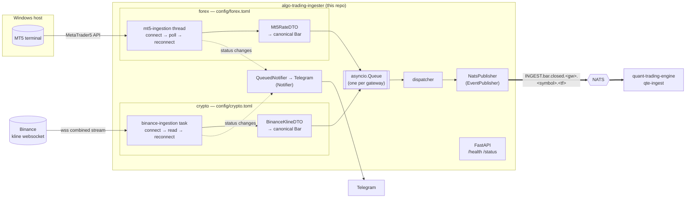

# Algo Trading Ingester

A market-data gateway for the algo-trading ecosystem. It watches upstream venues
for **closed bars**, normalises them into **one canonical schema**, and
publishes them **one way** to NATS for
[`quant-trading-engine`](https://github.com/rockingrow/quant-trading-engine)'s
`qte-ingest` to consume. Service status goes to Telegram.

One process runs several **markets** side by side — `SOURCE_MARKET=forex,crypto`
in `.env`, one `config/<market>.toml` per market:

| Market | File | Gateway | Notes |
| --- | --- | --- | --- |
| `forex` | `config/forex.toml` | `[mt5]` | MetaTrader 5, Windows, needs a running terminal |
| `crypto` | `config/crypto.toml` | `[binance]` | Binance kline websocket, any OS, no API key |

Each gateway owns its own source and its own publish queue, so a venue that
drops never touches the other market's bars.

---

## ⚡ Quick Start

### 1. Prerequisites

- Python 3.13+
- [uv](https://docs.astral.sh/uv/)
- A NATS server (JetStream only if `NATS_JETSTREAM_ENABLED=true`)
- For the `forex` market (MT5 gateway): **Windows** with the MetaTrader 5
  terminal installed and logged in to your broker
- For the `crypto` market (Binance gateway): outbound access to
  `stream.binance.com` — nothing else, the kline streams are public

### 2. Install

```bash
git clone https://github.com/rockingrow/algo-trading-ingester
cd algo-trading-ingester

# Process settings and secrets: NATS, Telegram, SOURCE_MARKET, MT5 credentials
cp .env.example .env

# What each market ingests: symbols, timeframes, one [gateway] table per venue
cp config/forex.example.toml  config/forex.toml
cp config/crypto.example.toml config/crypto.toml

uv sync                # or: make install-dev
```

`config/*.toml` is git-ignored — it is yours. Only the `*.example.toml`
templates are committed, so pulling never overwrites your symbols.

The `MetaTrader5` package is only installed on Windows (it has no other wheels);
on Linux or macOS the `forex` market reports itself degraded and the `crypto`
market keeps ingesting.

### 3. Run

```bash
uv run python -m ingester   # or: make run
```

- `GET /health` — liveness + NATS connection state
- `GET /status` — per-gateway status (with its market), symbols, timeframes,
  publish counters
- `/docs` — only when `APP_DOCS_ENABLED=true`

### 4. Test

```bash
uv run pytest               # or: make test — any OS, both venues are faked
```

---

## 🏗️ Architecture



### Design

| Concern | Where | Pattern |
| --- | --- | --- |
| Lifecycle, hand-off queue, publishing, status + notifications | `core/ingestion.py` → `BaseIngestion` | Template Method |
| Blocking SDK on a dedicated thread with reconnects | `core/ingestion.py` → `ThreadedIngestion` | Template Method |
| Asyncio feed on one task with reconnects | `core/ingestion.py` → `AsyncStreamIngestion` | Template Method |
| Per-stream de-duplication of emitted bars | `core/ingestion.py` → `BaseIngestion._is_new_bar` / `_remember_bar` | — |
| Pick gateways by name, once per market that enables them | `core/factory.py` → `IngestionFactory` | Factory / Registry |
| Market files → validated per-gateway settings | `settings.py` → `load_market`, `GATEWAY_SETTINGS` | Registry |
| Contracts between layers | `interfaces/` (`EventPublisher`, `Notifier`, `Ingestion`, `BarDTO`) | Interface (Protocol) / DIP |
| Venue payload → canonical schema | `gateways/<market>/<venue>/dto.py`, extending `core/dto.py` → `BaseBarDTO` | DTO |
| Venue business logic only | `gateways/<market>/<venue>/ingestion.py` | — |
| Venue SDK / socket / REST seam, so tests need no network | `gateways/forex/mt5/terminal.py`, `gateways/crypto/binance/{stream,history}.py` | Adapter (Protocol) |
| Non-blocking Telegram | `services/notification_service.py` → `QueuedNotifier` | Decorator |
| Wiring concrete classes | `providers.py` | Composition root |

A gateway never touches NATS or Telegram, and the core never touches a venue. A
gateway's **market** is the file its table was read from, so `[mt5]` in
`config/forex.toml` is forex and the table can never contradict it.

### MT5 bar-close detection

Keys below are from the `[mt5]` table of a market file, e.g. `config/forex.toml`.

MetaTrader5's Python API has no callbacks, so the MT5 gateway polls from its
own thread (`mt5-ingestion`). Every `poll_interval_seconds` it reads the newest
**completed** bars (`copy_rates_from_pos(symbol, tf, 1, catchup_bars)` —
position 0 is the bar still forming) and emits every bar newer than the last
one it emitted.

- **Symbols** are named bare (`XAUUSD`). The gateway asks the terminal what
  this broker calls the instrument — Exness sells it as `XAUUSDm` — and reads
  bars from that name, while the published `symbol` stays the configured one,
  so `event_id` survives a change of broker. A fully spelled `XAUUSDm` is used
  verbatim; `symbol_suffix` settles a tie between, say, `EURUSDm` and
  `EURUSDc`.
- **Start-up** only records the latest closed bar, so a restart does not
  re-publish history. With `backfill_on_start = true` it publishes that whole
  window instead, recovering the bars a crash would otherwise skip — pair it
  with JetStream, which drops the replayed duplicates by `event_id`.
- **Catch-up**: bars that closed during a terminal disconnect are published,
  oldest first, after reconnecting (up to `catchup_bars`).
- **Server time**: MT5 stamps bars in trade-server time. Set `server_timezone`
  so they are converted to real UTC.
- A close is seen when the next bar opens (its first tick), plus up to one poll
  interval.

### Binance bar-close detection

Keys below are from the `[binance]` table of a market file, e.g.
`config/crypto.toml`.

Binance pushes a kline update several times a second and flags the final one
with `k.x == true`, so nothing is polled: the gateway opens **one** combined
websocket (`/stream?streams=btcusdt@kline_1m/…`) carrying every symbol ×
timeframe and emits the bars Binance marks closed.

- **Symbols** are written the way Binance spells them (`BTCUSDT`). The stream
  name is lower-cased for the subscription; the published `symbol` is the
  configured one.
- **Timeframes** are the canonical labels (`M15`); the gateway maps them onto
  Binance's own spelling (`15m`) and back.
- **`close_time`** is derived as `open_time + timeframe`, not taken from
  Binance's `T` — which is one millisecond short of the next bar's open. A
  subscriber comparing venues should not have to know that.
- **Start-up**: the socket only carries bars that close while it is connected,
  so by default the bars that closed before this process started are not
  published. With `backfill_on_start = true` the gateway reads the last
  `catchup_bars` closed bars per stream from the REST endpoint at
  `klines_url` — after the socket is open, so no bar falls between the two —
  and publishes them first, giving a subscriber backfill and live bars as one
  continuous series. Only streams nothing has been published for yet are read,
  so a reconnect re-reads nothing; a REST failure is logged and skipped rather
  than costing the live socket. Pair it with JetStream, which drops the
  replayed duplicates by `event_id`.
- **De-duplication**: the newest open time emitted per stream is remembered, so
  a reconnect that replays a bar, or a repeated final update, publishes once.
- **Reconnects**: Binance closes a connection after 24 hours, and a socket that
  goes quiet for `idle_timeout_seconds` is dropped; either way the gateway
  dials again every `reconnect_interval_seconds`. Keep `idle_timeout_seconds`
  well above the slowest expected update, or a healthy stream is cut.
- **No credentials**: the kline streams and the klines endpoint are both
  public. Point `ws_url` at `wss://testnet.binance.vision/stream` and
  `klines_url` at `https://testnet.binance.vision/api/v3/klines` to test
  against the testnet — keep the two on the same product, or they disagree
  about which book the bars came from.

---

## 📨 NATS contract

**Subject** — `<NATS_SUBJECT_PREFIX>.bar.closed.<gateway>.<symbol>.<timeframe>`

```text
INGEST.bar.closed.mt5.XAUUSD.M15
INGEST.bar.closed.binance.BTCUSDT.M15
INGEST.bar.closed.>              # everything
INGEST.bar.closed.mt5.*.H1       # every MT5 symbol, H1 only
INGEST.bar.closed.binance.>      # the whole crypto market
```

Characters NATS reserves are replaced with `_` in the subject token only
(`XAUUSD.m` → `XAUUSD_m`); the payload keeps the symbol verbatim.

**Payload** — `BarClosedEvent` (`ingester/schemas/market_event_schema.py`), JSON,
all times UTC. Full examples:
[`bar.closed.mt5.json`](examples/nats/bar.closed.mt5.json),
[`bar.closed.binance.json`](examples/nats/bar.closed.binance.json).

| Field | Meaning |
| --- | --- |
| `schema_version` | `1.0` — bumped on breaking changes |
| `event_id` | `<gateway>:<symbol>:<tf>:<open epoch>` — deterministic; de-dup key and JetStream `Nats-Msg-Id` |
| `event_type` | `bar.closed` |
| `source` | `gateway`, `market` (the file it was configured in), `ingester_id`, `venue` (MT5 trade server, or the Binance endpoint host) |
| `symbol`, `timeframe` | as configured; timeframe ∈ `M1 M5 M15 M30 H1 H4 D1 W1` |
| `bar` | `open_time`, `close_time`, `open`, `high`, `low`, `close`, `volume`, `tick_count`, `quote_volume`, `spread` |

Venue-specific fields are `null` rather than zero when a venue does not have
them (MT5 has no `quote_volume`, Binance has no `spread`).

**Delivery** — core NATS by default (fire-and-forget). With
`NATS_JETSTREAM_ENABLED=true`, bars are persisted on a stream named after
`NATS_SUBJECT_PREFIX` (created if missing, never reconfigured) and
de-duplicated by `event_id`. The stream name is derived from the prefix rather
than configured separately, so it can never drift from the subjects it has to
carry. One stream and one subject tree carry every market: `market` and
`gateway` tell a subscriber what it is looking at, so nothing downstream
branches per venue.

---

## 🔔 Telegram notifications

With `TELEGRAM_ENABLED=true`, the bot posts to every chat in `TELEGRAM_CHAT_IDS`:

- ingester **running** (endpoint, NATS subject, symbols × timeframes) /
  **stopped** / **degraded** (started, but NATS is down, a market file would
  not load, a gateway refused to start, or nothing is ingesting at all)
- each gateway's status changes: `starting`, `running`, `disconnected` (with the
  reason), `stopped` — the **running** message names each stream as
  `<market>/<GATEWAY>`, so it is clear which file it came from
- NATS **disconnected** / **reconnected**

Messages go through a bounded queue, so a slow Telegram never delays a bar.

### Errors in their own chat

`TELEGRAM_LOG_ERRORS_ENABLED=true` mirrors every `ERROR` log record into
`TELEGRAM_LOG_CHAT_IDS` (falling back to `TELEGRAM_CHAT_IDS`), with its own
optional bot token and its own queue, so a burst of failures cannot delay a
lifecycle message. Identical records inside `TELEGRAM_LOG_DEDUP_WINDOW` seconds
are dropped — a failing poll repeats every interval. Only `ingester.*` records
are forwarded; uvicorn keeps its own loggers.

### Staying up

The ingester does not exit because a dependency is down. If NATS is unreachable
at start-up, a market's TOML file is missing or malformed, or a gateway refuses
to start, it logs the error, posts an **Ingester Degraded** message and keeps
running: NATS reconnects underneath, the markets that *did* load keep ingesting,
and a supervisor restart would only drop more bars. One malformed record on one
symbol — or one unreadable websocket frame — is logged and skipped without
starving the rest.

---

## ⚙️ Configuration

Configuration lives in two places, because the two change for different
reasons.

### 1. `.env` — this process and this host

The FastAPI server, logging, NATS, Telegram, which markets to run, and venue
**credentials**. See [`.env.example`](.env.example) for every key with comments.

| Key | Example |
| --- | --- |
| `SOURCE_MARKET` | `forex,crypto` — which market files to load and run |
| `SOURCE_CONFIG_DIR` | `config` |
| `APP_HOST`, `APP_PORT` | `0.0.0.0`, `8090` |
| `APP_INSTANCE_ID` | `vps-mt5-01` (blank = hostname) |
| `NATS_HOST`, `NATS_PORT`, `NATS_TOKEN` | `localhost`, `4222`, `…` |
| `NATS_SUBJECT_PREFIX` | `INGEST` |
| `NATS_JETSTREAM_ENABLED` | `false` |
| `TELEGRAM_ENABLED`, `TELEGRAM_BOT_TOKEN`, `TELEGRAM_CHAT_IDS` | `true`, `…`, `-100…,-100…_42` |
| `TELEGRAM_LOG_ERRORS_ENABLED`, `TELEGRAM_LOG_CHAT_IDS` | `true`, `-100…_13` |
| `MT5_LOGIN`, `MT5_PASSWORD`, `MT5_SERVER`, `MT5_TERMINAL_PATH`, `MT5_TIMEOUT_MS` | blank = use the logged-in terminal |

### 2. `config/<market>.toml` — what that market ingests

One file per market named in `SOURCE_MARKET`, one `[gateway]` table per venue
inside it, `enable` first. The **market is the file's name** and is never
written in the table. Templates:
[`forex.example.toml`](config/forex.example.toml),
[`crypto.example.toml`](config/crypto.example.toml). Your own `config/*.toml`
is git-ignored.

```toml
# config/forex.toml
[mt5]
enable = true
symbols = ["XAUUSD", "EURUSD"]   # bare names; the broker affix is detected
symbol_suffix = ""               # "m" to force Exness naming
timeframes = ["M1", "M15", "H1"]
server_timezone = "Europe/Athens"
poll_interval_seconds = 1.0
catchup_bars = 5
backfill_on_start = false
reconnect_interval_seconds = 5.0
```

```toml
# config/crypto.toml
[binance]
enable = true
symbols = ["BTCUSDT", "ETHUSDT"]
timeframes = ["M1", "M15", "H1"]
ws_url = "wss://stream.binance.com:9443/stream"
backfill_on_start = true
catchup_bars = 16                # only used by the backfill; max 1000
klines_url = "https://api.binance.com/api/v3/klines"
http_timeout_seconds = 10.0
reconnect_interval_seconds = 5.0
ping_interval_seconds = 20.0
ping_timeout_seconds = 20.0
idle_timeout_seconds = 90.0
```

`enable = false` (or a missing `enable`) leaves that gateway out; dropping a
market from `SOURCE_MARKET` stops reading its file at all.

What a market file is **not** allowed to say:

- `market` — it is the file's name, so a table could only contradict it.
- `login`, `password`, `server`, `terminal_path`, `timeout_ms` — credentials
  and host paths belong in `.env` as `MT5_…`. These files are meant to be read
  and diffed.
- a key no gateway has (a typo), or an unknown `[table]`.

Each is refused at start-up instead of being quietly accepted, as is one
gateway enabled in two markets — MetaTrader 5 keeps a single process-wide
terminal session, and `event_id` carries no market, so the second one is
refused and reported.

A file that is missing, unparseable or refused for any of the above, and a
process where nothing at all ends up ingesting, is reported as **Ingester
Degraded** — the markets that loaded still run.

---

## 🧩 Adding a gateway

A new venue needs only its own business logic. Take Kraken as the example:

1. **Enum** — add `KRAKEN = "kraken"` to `GatewayEnum` in `schemas/enums.py`
   (it becomes a subject token, so the value is contract).
2. **Settings** — in `settings.py`, subclass `GatewaySettings` with
   `env_prefix="KRAKEN_"` (it inherits `ENABLE`, `SYMBOLS`, `TIMEFRAMES`,
   `MARKET`), then add one row to `GATEWAY_SETTINGS`. The prefix only serves
   keys that belong in `.env` — credentials and host paths; everything else
   comes from the market file.
3. **Venue seam** — `gateways/crypto/kraken/{terminal,stream}.py` (the folder of
   the market the venue natively serves; a new market is a new folder with its
   own `__init__.py`): a `Protocol` for
   the slice of the SDK or socket you use, so tests can fake it (see
   `Mt5Terminal`, `KlineStream`).
4. **DTO** — `gateways/crypto/kraken/dto.py`: a `BaseBarDTO` subclass for the
   raw payload that implements `to_bar(timeframe) -> Bar`.
5. **Ingestion** — `gateways/crypto/kraken/ingestion.py`:
   - an asyncio websocket: subclass `AsyncStreamIngestion` and implement
     `connect`, `receive`, `handle`, `disconnect`, like Binance; `handle`
     calls `self.emit_bar(symbol, timeframe, dto.to_bar(timeframe))` for each
     closed bar;
   - a blocking SDK: subclass `ThreadedIngestion` and implement `connect`,
     `poll`, `disconnect`, like MT5.
   Guard each bar with `self._is_new_bar(...)` / `self._remember_bar(...)` so
   a replayed bar is emitted once. Raise `GatewayConnectionError` when the
   venue drops; use
   `self._set_status(...)` for status changes — the core notifies Telegram.
6. **Register** — one line in `providers.make_ingestion_factory()`:
   `factory.register(GatewayEnum.KRAKEN, build_kraken_ingestion)`. The builder
   reads its settings with `context.config_as(KrakenSettings)` and passes the
   shared publisher, notifier and instance id on with
   `**context.ingestion_dependencies()`.
7. **Enable it** — a `[kraken]` table with `enable = true` in the market file
   it belongs to, and that market in `SOURCE_MARKET`. The same builder serves
   every market that enables it.
8. **Template** — add the table to `config/<market>.example.toml`, commented.

Publishing, subjects, de-duplication, queueing, notifications and the HTTP
status endpoint come for free.

---

## 📁 Project structure

```text
algo-trading-ingester/
├── ingester/
│   ├── api/             # FastAPI routes: /health, /status
│   ├── core/            # Base ingestions, BaseBarDTO, IngestionFactory, errors
│   ├── gateways/        # One folder per market, one per venue inside it
│   │   ├── forex/
│   │   │   └── mt5/     # terminal adapter, DTO, bar-close business logic
│   │   └── crypto/
│   │       └── binance/ # websocket adapter, kline DTO, bar-close business logic
│   ├── helpers/         # Telegram message templates, emoji
│   ├── interfaces/      # Protocols: EventPublisher, Notifier, Ingestion, BarDTO
│   ├── schemas/         # Canonical wire contract: enums, Bar, BarClosedEvent
│   ├── services/        # NATS connection/publisher, Telegram notifier
│   ├── app.py           # FastAPI application factory (lifespan)
│   ├── runtime.py       # Ordered start/stop of notifier, NATS, gateways
│   ├── providers.py     # Composition root + gateway registration
│   ├── settings.py      # Settings from .env + market files (config/*.toml)
│   ├── logger.py        # Console + daily file logging
│   └── main.py          # Entrypoint (uvicorn)
├── config/              # Per-market gateway config; *.example.toml committed,
│                        # the operator's own *.toml git-ignored
├── examples/nats/       # Example payloads — the contract for qte-ingest
├── tests/               # Pytest suite (both venues faked, runs on any OS)
├── .claude/             # Claude Code settings + SessionStart hook (uv sync)
├── AGENTS.md            # Shared instructions for coding agents
├── CLAUDE.md            # Claude Code specifics (imports AGENTS.md)
├── .env.example
├── changelog.md
├── Makefile
└── pyproject.toml
```
