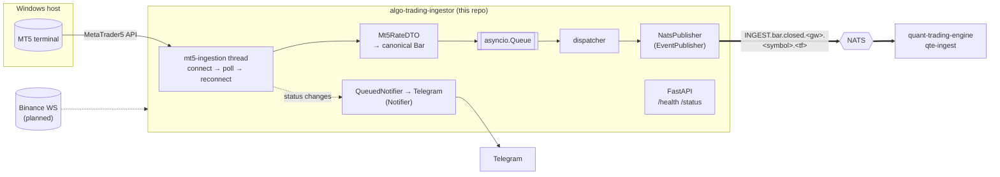

# Algo Trading Ingestor

A market-data gateway for the algo-trading ecosystem. It watches upstream venues
for **closed bars**, normalises them into **one canonical schema**, and
publishes them **one way** to NATS for
[`quant-trading-engine`](https://github.com/rockingrow/quant-trading-engine)'s
`qte-ingest` to consume. Service status goes to Telegram.

- **MetaTrader 5** — implemented (Windows, needs a running MT5 terminal).
- **Binance websocket** — planned; the core is built so it only has to add its
  own business logic (see [Adding a gateway](#-adding-a-gateway)).

---

## ⚡ Quick Start

### 1. Prerequisites

- Python 3.13+
- [uv](https://docs.astral.sh/uv/)
- A NATS server (JetStream only if `NATS_JETSTREAM_ENABLED=true`)
- For the MT5 gateway: **Windows** with the MetaTrader 5 terminal installed
  and logged in to your broker

### 2. Install

```bash
git clone https://github.com/rockingrow/algo-trading-ingestor
cd algo-trading-ingestor

cp .env.example .env   # symbols, timeframes, NATS, Telegram, MT5 …
uv sync                # or: make install-dev
```

The `MetaTrader5` package is only installed on Windows (it has no other wheels).

### 3. Run

```bash
uv run python -m ingestor   # or: make run
```

- `GET /health` — liveness + NATS connection state
- `GET /status` — per-gateway status, symbols, timeframes, publish counters
- `/docs` — only when `APP_DOCS_ENABLED=true`

### 4. Test

```bash
uv run pytest               # or: make test — runs on any OS (MT5 is faked)
```

---

## 🏗️ Architecture



### Design

| Concern | Where | Pattern |
| --- | --- | --- |
| Lifecycle, hand-off queue, publishing, status + notifications | `core/ingestion.py` → `BaseIngestion` | Template Method |
| Blocking SDK on a dedicated thread with reconnects | `core/ingestion.py` → `ThreadedIngestion` | Template Method |
| Pick gateways by name from `.env` | `core/factory.py` → `IngestionFactory` | Factory / Registry |
| Contracts between layers | `interfaces/` (`EventPublisher`, `Notifier`, `Ingestion`, `BarDTO`) | Interface (Protocol) / DIP |
| Venue payload → canonical schema | `gateways/<venue>/dto.py` | DTO |
| Venue business logic only | `gateways/<venue>/ingestion.py` | — |
| Non-blocking Telegram | `services/notification_service.py` → `QueuedNotifier` | Decorator |
| Wiring concrete classes | `providers.py` | Composition root |

A gateway never touches NATS or Telegram, and the core never touches a venue.

### MT5 bar-close detection

MetaTrader5's Python API has no callbacks, so the MT5 gateway polls from its
own thread (`mt5-ingestion`). Every `MT5_POLL_INTERVAL_SECONDS` it reads the
newest **completed** bars (`copy_rates_from_pos(symbol, tf, 1, MT5_CATCHUP_BARS)`
— position 0 is the bar still forming) and emits every bar newer than the last
one it emitted.

- **Start-up** only records the latest closed bar, so a restart does not
  re-publish history.
- **Catch-up**: bars that closed during a terminal disconnect are published,
  oldest first, after reconnecting (up to `MT5_CATCHUP_BARS`).
- **Server time**: MT5 stamps bars in trade-server time. Set
  `MT5_SERVER_TIMEZONE` so they are converted to real UTC.
- A close is seen when the next bar opens (its first tick), plus up to one poll
  interval.

---

## 📨 NATS contract

**Subject** — `<NATS_SUBJECT_PREFIX>.bar.closed.<gateway>.<symbol>.<timeframe>`

```text
INGEST.bar.closed.mt5.XAUUSD.M15
INGEST.bar.closed.>              # everything
INGEST.bar.closed.mt5.*.H1       # every MT5 symbol, H1 only
```

Characters NATS reserves are replaced with `_` in the subject token only
(`XAUUSD.m` → `XAUUSD_m`); the payload keeps the symbol verbatim.

**Payload** — `BarClosedEvent` (`ingestor/schemas/market_event_schema.py`), JSON,
all times UTC. Full example:
[`examples/nats/bar.closed.mt5.json`](examples/nats/bar.closed.mt5.json).

| Field | Meaning |
| --- | --- |
| `schema_version` | `1.0` — bumped on breaking changes |
| `event_id` | `<gateway>:<symbol>:<tf>:<open epoch>` — deterministic; de-dup key and JetStream `Nats-Msg-Id` |
| `event_type` | `bar.closed` |
| `source` | `gateway`, `market`, `ingestor_id`, `venue` (e.g. MT5 server) |
| `symbol`, `timeframe` | as configured; timeframe ∈ `M1 M5 M15 M30 H1 H4 D1 W1` |
| `bar` | `open_time`, `close_time`, `open`, `high`, `low`, `close`, `volume`, `tick_count`, `quote_volume`, `spread` |

Venue-specific fields are `null` rather than zero when a venue does not have
them (MT5 has no `quote_volume`, Binance has no `spread`).

**Delivery** — core NATS by default (fire-and-forget). With
`NATS_JETSTREAM_ENABLED=true`, bars are persisted on stream `NATS_STREAM_NAME`
(created if missing, never reconfigured) and de-duplicated by `event_id`.

---

## 🔔 Telegram notifications

With `TELEGRAM_ENABLED=true`, the bot posts to every chat in `TELEGRAM_CHAT_IDS`:

- ingestor **running** (endpoint, NATS subject, symbols × timeframes) /
  **stopped** / **failed to start**
- each gateway's status changes: `starting`, `running`, `disconnected` (with the
  reason), `stopped`
- NATS **disconnected** / **reconnected**

Messages go through a bounded queue, so a slow Telegram never delays a bar.

---

## ⚙️ Configuration

Everything is read from `.env`. See [`.env.example`](.env.example) for every
key with comments. The main ones:

| Key | Example |
| --- | --- |
| `APP_HOST`, `APP_PORT` | `0.0.0.0`, `8090` |
| `APP_INSTANCE_ID` | `vps-mt5-01` (blank = hostname) |
| `APP_GATEWAYS` | `mt5` |
| `NATS_HOST`, `NATS_PORT`, `NATS_TOKEN` | `localhost`, `4222`, `…` |
| `NATS_SUBJECT_PREFIX` | `INGEST` |
| `NATS_JETSTREAM_ENABLED` | `false` |
| `TELEGRAM_ENABLED`, `TELEGRAM_BOT_TOKEN`, `TELEGRAM_CHAT_IDS` | `true`, `…`, `-100…,-100…_42` |
| `MT5_SYMBOLS` | `XAUUSD,EURUSD` |
| `MT5_TIMEFRAMES` | `M1,M15,H1` |
| `MT5_SERVER_TIMEZONE` | `Europe/Athens` |
| `MT5_LOGIN`, `MT5_PASSWORD`, `MT5_SERVER`, `MT5_TERMINAL_PATH` | blank = use the logged-in terminal |

---

## 🧩 Adding a gateway

Binance (or any venue) needs only its own business logic:

1. **Settings** — in `settings.py`, subclass `GatewaySettings` with
   `env_prefix="BINANCE_"` (it inherits `SYMBOLS`, `TIMEFRAMES`, `MARKET`) and
   add it to `Settings`.
2. **DTO** — `gateways/binance/dto.py`: a model for the raw kline that
   implements `to_bar(timeframe) -> Bar`.
3. **Ingestion** — `gateways/binance/ingestion.py`:
   - an asyncio websocket: subclass `BaseIngestion`, implement
     `_start_source()` / `_stop_source()` (start/cancel the socket task) and call
     `self.emit_bar(symbol, timeframe, dto.to_bar(timeframe))` for each closed
     kline (`k.x == true`);
   - a blocking SDK: subclass `ThreadedIngestion` and implement `connect`,
     `poll`, `disconnect`, like MT5.
   Raise `GatewayConnectionError` when the venue drops; use
   `self._set_status(...)` for status changes — the core notifies Telegram.
4. **Register** — one line in `providers.make_ingestion_factory()`:
   `factory.register(GatewayEnum.BINANCE, build_binance_ingestion)`.
5. Enable it: `APP_GATEWAYS=mt5,binance`.

Publishing, subjects, de-duplication, queueing, notifications and the HTTP
status endpoint come for free.

---

## 📁 Project structure

```text
algo-trading-ingestor/
├── ingestor/
│   ├── api/             # FastAPI routes: /health, /status
│   ├── core/            # BaseIngestion, ThreadedIngestion, IngestionFactory, errors
│   ├── gateways/
│   │   └── mt5/         # terminal adapter, DTO, bar-close business logic
│   ├── helpers/         # Telegram message templates, emoji
│   ├── interfaces/      # Protocols: EventPublisher, Notifier, Ingestion, BarDTO
│   ├── schemas/         # Canonical wire contract: enums, Bar, BarClosedEvent
│   ├── services/        # NATS connection/publisher, Telegram notifier
│   ├── app.py           # FastAPI application factory (lifespan)
│   ├── runtime.py       # Ordered start/stop of notifier, NATS, gateways
│   ├── providers.py     # Composition root + gateway registration
│   ├── settings.py      # Pydantic settings (grouped) loaded from .env
│   ├── logger.py        # Console + daily file logging
│   └── main.py          # Entrypoint (uvicorn)
├── examples/nats/       # Example payloads — the contract for qte-ingest
├── tests/               # Pytest suite (MT5 faked, runs on any OS)
├── .env.example
├── changelog.md
├── Makefile
└── pyproject.toml
```
